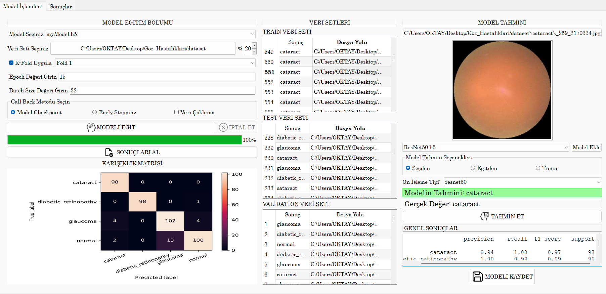
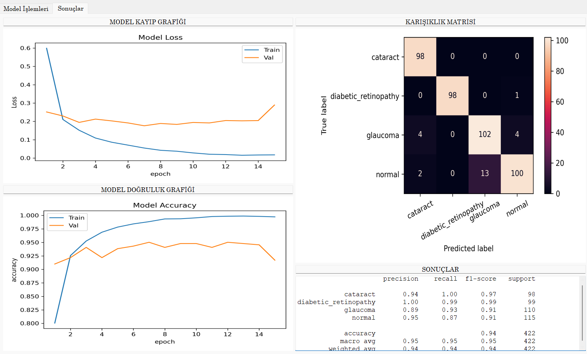

# Göz Hastalıkları Teşhis ve Model Eğitim Projesi

Bu proje, çeşitli göz hastalıklarını teşhis etmek amacıyla derin öğrenme modelleri kullanarak geliştirilmiştir. Ayrıca, kullanıcı dostu bir ara yüz üzerinden bu modellerin eğitimini mümkün kılan bir yapı sunmaktadır.


## Proje Görüntüleri

   

   
## Veri Seti

Projede kullanılan veri seti, IDRiD, Oculur Tanıma ve HRF gibi kaynaklardan elde edilen göz hastalıklarıyla ilgili geniş kapsamlı görüntüleri içermektedir. Toplamda her bir sınıfta yaklaşık 1000 görüntü bulunmaktadır.

## Proje Katkıları ve Özellikler

- Göz hastalıklarının teşhis edilmesinin yanı sıra, kullanıcı dostu bir ara yüz ile modellerin eğitimi sağlanmaktadır.
- Veri seti yapısı aşağıdaki şekildedir.
```bash
Veri Seti/
│
├── cataract
│    └── cataract_datas.jp
├── diabetic_retinopathy
│    └── diabetic_retinopathy_datas.jpg
├── glaucoma
│    └── glaucoma_datas.jpg
└── normal
    └── normal_datas.jpg
```
- Uygulama dinamik olarak tasarlanmıştır ve veri seti belirtilen dosyalamaya uygun şekilde verildiği takdirde kullanıcılar, veri seti üzerinde kendi özelleştirilmiş modellerini eğitebilir ve değerlendirebilirler.
- Eğitilmiş modeliniz ile tahmin veya fine tune işlemi yapabilmek için  modellerinizi projedeki  `model` dosyası içerisine atmanız gerekir. (Default model bulunmaktadır.)
- Projede kullanılan veri seti ve çeşitli göz hastalıkları, modelin genel performansını değerlendirmek için kapsamlı bir test ortamı sunmaktadır.

- Veri setine buradan erişebilirsiniz: [Veri Seti](https://www.kaggle.com/datasets/gunavenkatdoddi/eye-diseases-classification)

- Ayrıca Colab üzerinden eğitim yapabilirsiniz.(Aynı eğitimi Kerastan modeli indirip model dosyasına yükleyerek ara yüz ile de yapabilirsiniz)  [VGG16 model eğitim Colab Kodu](https://colab.research.google.com/drive/1Jf234laB8Aj3YguPPMpw0kP6WdFKxQ5X?usp=sharing)

## Uygulama Geliştirme Ortamı

### Programlama Dili
Proje, Python programlama dilinde geliştirilmiştir. Python'un geniş kütüphane desteği ve okunabilir syntax'i tercih edilmesinde etkili olmuştur.

### Geliştirme Ortamı
- **Spyder IDE:** Ana entegre geliştirme ortamı olarak kullanılmıştır. Tasarım, geliştirme ve hata ayıklama süreçlerinde etkili bir şekilde işlev görmüştür.
- **QtDesigner:** Kullanıcı ara yüzü tasarımını kolaylaştıran bir araç olarak tercih edilmiştir. Kullanıcı dostu bir ara yüzün oluşturulmasına katkı sağlamıştır.
- **Jupyter Notebook ve Google Colab:** Model eğitimi ve testi için interaktif bir ortam sağlamış ve bu süreçleri daha erişilebilir hale getirmiştir.

### Derin Öğrenme Modeli Eğitimi
Model eğitimleri Google Colab üzerinde GPU hızlandırma ile gerçekleştirilmiştir. Bu, eğitim sürecini hızlandırmış ve büyük veri setleriyle etkili çalışma sağlamıştır.

### Kullanılan Kütüphaneler
- **Keras ve TensorFlow:** Derin öğrenme modelinin geliştirilmesinde temel kütüphaneler olarak kullanılmıştır.
- **scikit-learn, Matplotlib (pyplot), OpenCV (cv2):** Projede çeşitli aşamalarda işlevsellik katmış ve veri işleme, görselleştirme ve model performans değerlendirme süreçlerine destek sağlamıştır.

## Kurulum ve Çalıştırma

1. Projeyi klonlayın
   ```bash
   git clone https://github.com/mustafaoktayarslan/Eye-Disease-Diagnosis-with-Deep-Learning.git


2. Gereklilikleri kurun
   ```bash
   pip install -r requirements.txt
   
   
3. Projeyi çalıştırın
    ```bash
   python main.py
